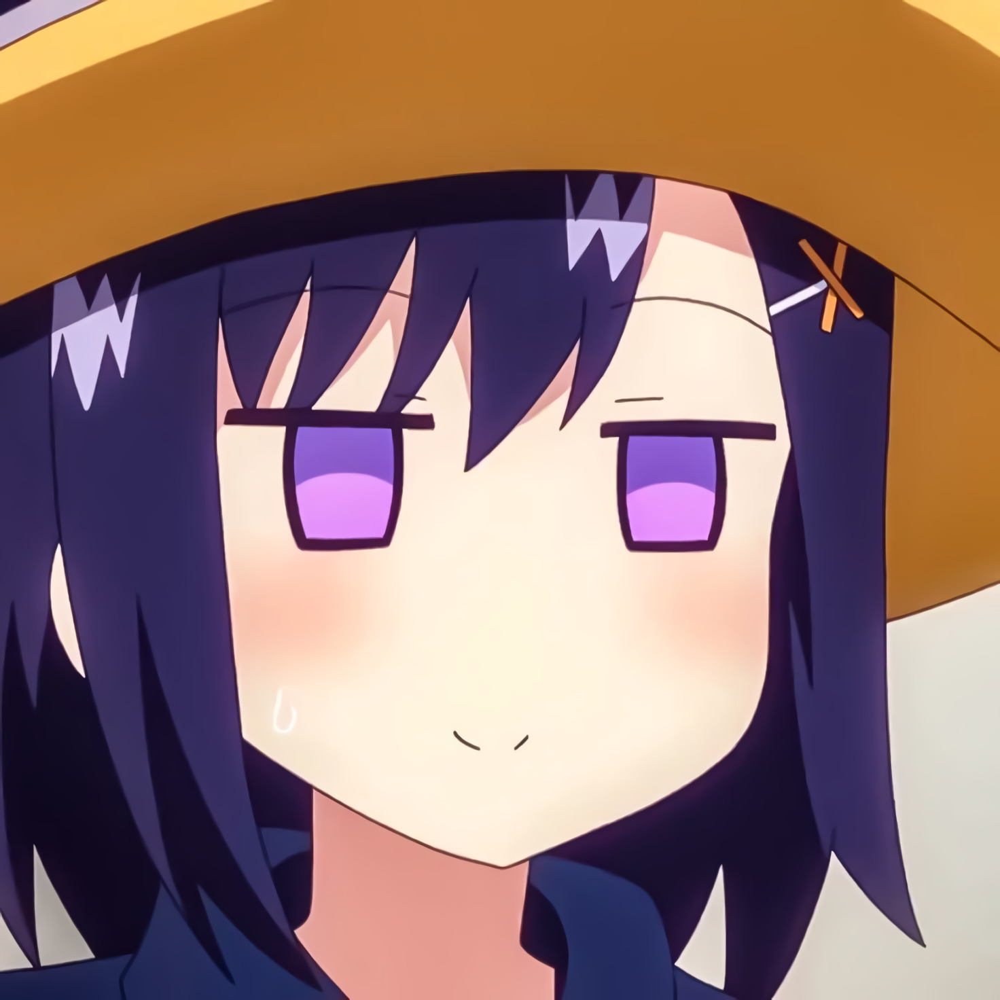

<p align="center">
 
 <h1 align="center">Tsukinose</h1>
 <h3 align="center">Discord bot for various tasks</h3>
</p>

<p align="center">
 <a href="#overview">Overview</a>,
 <a href="#install">Install</a>
</p>

# Overview

Vigne is [harmony](https://github.com/harmonyland/harmony) bot, made in
[Deno](https://deno.land/). Tsukinose is a cute girl from Gabriel DropOut manga
:3.

# How to use

## Already hosted

You can invite bot by
[this link](https://discord.com/api/oauth2/authorize?client_id=977746174574465085&scope=bot+applications.commands&permissions=294208515334).
Type "/" to see commands!

## Host by yourself

1. Install [deno](https://deno.land/#installation)

1. Set up your [.env](example.env) (example in [example.env](example.env))

```env
BOT_TOKEN="YOUR_TOKEN"
BOT_COLOR="#925dc4"
```

1. Start bot via `make start`

Now you have running bot!
